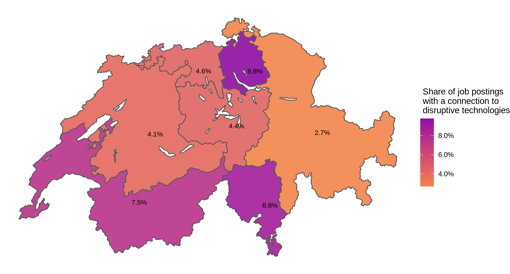
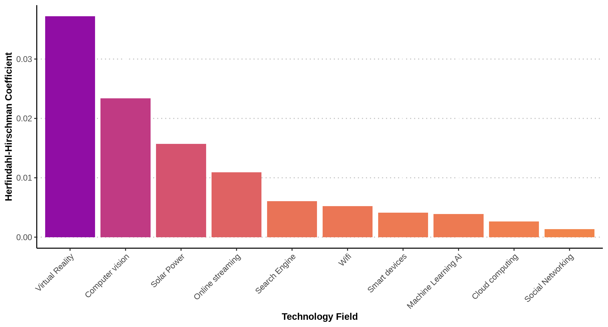

---
output:
  html_document:
    includes:
     after_body: "https://innoscape.de/general_stuff/footer.html"
    title: "jobs_disruptive_tech"
    self_contained: false
    theme: null
    css: "styles/css_style.css"
    highlight: null
    mathjax: null
---
<head>
<script async src="https://www.googletagmanager.com/gtag/js?id=UA-71167447-1"></script>

<script>
  window.dataLayer = window.dataLayer || [];
  function gtag(){dataLayer.push(arguments);}
  gtag('js', new Date());
  gtag('config', 'UA-71167447-1', { 'anonymize_ip': true });
</script>

<div class="container-fluid main-container">

<meta property='og:title' content='Innoscape.ch | Spreading Out: The Adoption of Disruptive Technologies in Switzerland'/>
<meta property='og:image' content='To what extent have disruptive technologies spread to Switzerland?'/>
<meta property='og:url' content='https://innoscape.ch/en/publications/jobs_disruptive_tech'>
</head>


```{r, echo=FALSE, message=FALSE, warning=FALSE}
# Load packages
```

<!-- START with text -->
### **Spreading Out: The Adoption of Disruptive Technologies in Switzerland**

<br>

<p style="text-align: left; line-height: 100%;">
*October 2022* by <a href="#" data-placement="bottom" data-toggle="tooltip"  data-html="true" title="<b>Matthias Niggli</b> is a research data scientist and project collaborator. He holds a PhD from the University of Basel and has a background in economic policy from previous positions in the public sector. He has a special interest in experimenting with all kinds of machine-learning methods and is enthusiastic about discovering novel approaches to visualize data. <br> 
<a href='https://www.linkedin.com/in/matthias-niggli-b47b33119' target = “_blank”>LinkedIn</a><br>
<a href='mailto:matthias.niggli@unibas.ch'>matthias.niggli@unibas.ch</a>">*Matthias Niggli*</a>
</p>

<details> 
<summary>*About*</summary> 

The analysis is part of <a href='https://innoscape.ch' target = “_blank”>Innoscape</a>. The project is conducted by the <a href='https://cieb.unibas.ch/en/' target = “_blank”>Center for International Economics and Business | CIEB of the University of Basel</a> aiming to investigate the Swiss innovation landscape from an economic perspective. 

<p style="text-align: left;">
Follow us on social media &nbsp;&nbsp;
    <a href="https://www.linkedin.com/company/cieb-unibas" class="fa fa-linkedin" style='color:black;text-decoration: none;' target='_blank'></a>
    &nbsp;&nbsp;
    <a href="https://twitter.com/cieb_unibas/" class="fa fa-twitter" style='color:black;text-decoration: none;' target='_blank'></a>
    &nbsp;&nbsp;
    <a href="https://github.com/cieb-unibas/" class="fa fa-github" style='color:black;text-decoration: none;' target='_blank'></a>
</p>
</details> 

<!-- TITLE PICTURE -->
{width=100%}
<a href="https://www.flickr.com/photos/peterscherub/25876043386/in/photolist-Fqzuc5-3t24Mi-dy6dcJ-2jhZg6w-2kiN8t5-2jdd6kB-2jpz9an-qWUEi-42hTw-96TPNF-6ra2g5-2narGBf-2hyQr52-2hGR6Tg-KumRk2-86xCaj-36xb8r-JXYV8B-2hBSwbM-fpjCmm-Z7SqRL-4VGA3p-efrWCg-eudzj6-eaJkQT-8zYqr-MZYMZ-6dSQBq-EqeziL-7M77cV-2jkA9J6-6dNGm8-o31ZEr-cXvKfG-N1SdSj-4ypy7y-516fT-8J74Bo-aFGjS-6nDDBq-4bQVSd-ov8zFH-37hMGL-2nfqLiC-3QphCL-5rsXD-KWGse-cqhNc-6atJkL-2fnoCam" target="_blank">Flickr | Judy Dean</a>
<!-- <a href="https://www.flickr.com/photos/genista/86283540/in/photolist-8Ce6f-83rDQo-fcSjgR-5EJjKM-hWWfrE-TjKPhm-cb5ZG-83oAxe-83oAdt-bCoZrd-8vwmtf-bUHTWa-oVv2n1-NpEk3-4T4jkd-voDbE-9TJ5RD-a4aE9c-2mjws8y-dCjqYj-eQin8e-83owXV-5zDZx8-8UvNaM-5zJrij-4T4jwE-bC15vo-6utwjq-c38qMG-SdV3BE-eQuLnJ-9Rchh3-9R9omF-9Dy2X3-Hbrxfw-en4KLF-6vGRDj-91WmfY-BYy1M-6pymgg-5a1RoJ-d2Bem-bQULmV-4SwBCP-d2BcP-7KL6W4-nE86Xx-chfar3-6vGRG7-6pykR4" target="_blank">Flickr | Kai Schreiber</a> -->

<br>

<!-- TEASER ABSTRACT -->
**New ideas and technologies power the engine of modern economies. Some technologies have a limited impact in particular industries of the economy. But others, such as autonomous driving or cloud computing, are sometimes labeled as *disruptive* because they strongly transform processes within entire industries or even affect the overall economy.**

<!-- INTRODUCTION -->
In a recent study, <a href=https://www.nber.org/papers/w28999 target = “_blank”> Bloom, Hassan, Kalyani, Lerner & Tahoun (2021)</a> define a set of 29 disruptive technologies that have been strongly emerging over the last 3 decades (e.g., Wifi, Cloud Computing, Solar Power, or Artificial Intelligence). Their findings highlight how disruptive technologies gradually spread throughout the US economy and the labor market. They diffuse from pioneering regions to the rest of the country, and from high-paying occupations to lower-paid ones. Yet, pioneering regions obtain persistently higher numbers of high-paying jobs. 

To what extent have disruptive technologies spread in Switzerland? Data from <a href="https://www.jobspikr.com/" target ="blank">JobsPikr</a> on over 3 million Swiss job postings over the last 2 years allows us to approach this question.  We assign job postings to disruptive technologies if their full text contains keywords as defined by Bloom et al. (2021). This provides an estimate of how prevalent these technologies are in Switzerland.

<!-- METHODOLOGY BOX / LINK TO PAPER -->
<details>
<summary>*Click here to get a more information on the data.*</summary>
<br>
The sample of job postings we use for this analysis is obtained from <a href="https://www.jobspikr.com/" target ="blank">JobsPikr</a> and consists of over 3 million Swiss job postings published by nearly 77 thousand employers. We assign job postings to so-called *Grossregionen* (which correspond to <a href="https://ec.europa.eu/eurostat/web/regions/background" target ="blank"> Eurostat NUTS-2 regions</a>), according to information about the location of the position described in the job posting provided by JobsPickr (e.g., canton or cities). 

We then check if job postings mention technological keywords defined by <a href=https://www.nber.org/papers/w28999 target = “_blank”> Bloom, Hassan, Kalyani, Lerner & Tahoun (2021)</a> in their full text. To do so, we first translate all technological keywords to German, French, and Italian using Google translate and look for matches with the English keywords (e.g., “additive manufactur”) or the translations (e.g, “additive fertigung”, “fabrication additive”, “produzione di additive”). If a keyword is mentioned in a particular job posting (e.g., “additive fertigung”), we assign the job posting to the corresponding technology (e.g., 3d Printing).
</details>

Overall, we detect slightly over 200’000 postings with a connection to the 29 disruptive technologies from Bloom et al. (2021) in our sample (i.e., around 6% of all postings). It is noteworthy that these postings are not distributed proportionally across Swiss regions in our sample but are geographically clustered. This suggests that disruptive technologies are more prevalent in some regions compared to others. 

<hr class="hr_red">
#### **Figure 1: Regional Specialization in Disruptive Technologies**
```{r, echo=FALSE, message=FALSE, warning=FALSE}

```
<span style="font-size:0.8em">*Sources and notes: Estimated share of job postings with a connection to disruptive technologies as defined in <a href=https://www.nber.org/papers/w28999 target = “_blank”> Bloom et al. (2021)</a> among all job postings of a region. Own estimations of the <a href="https://www.cieb.unibas.ch" target ="blank">CIEB</a> using job postings data from <a href="https://www.jobspikr.com/" target ="blank">JobsPikr</a>. Data to replicate the plot is available on <a href="https://github.com/cieb-unibas/jobs_disruptive_tech" target ="blank">Github</a>.*</span>

<!-- HIGHLIGHT -->
<div class=bloc_div>
<blockquote>***Disruptive technologies are far more widespread in some Swiss regions compared to others***</blockquote>
</div>

Figure 1 illustrates the aforementioned pattern. According to our data sample, the Zurich area has the largest share of job postings with a connection to disruptive technologies among all of its job postings. Almost 10% of the Zurich area’s postings in our sample have a connection to at least one of the 29 disruptive technologies. This share can be understood as the extent to which a region is specialized in disruptive technologies. Hence, our data suggests that the Région Lemanique lags the Zurich area, and Northwestern Switzerland, Central Switzerland or the Espace Mittelland are only around half as specialized in these technologies compared to Zurich. Overall, though, disruptive technologies seem to have spread in Switzerland to a similar extent as Bloom et al. (2021) report for the USA.

But how prevalent are specific technologies across the almost 77 thousand Swiss employers in our sample? What share of these employers mentions a given technology? Consider, for example, “Cloud Computing”. Almost 4400 employers mention it in at least one of their job postings, corresponding to a share of almost 6%. To evaluate the diffusion of all other disruptive technologies as well, we identically calculate employer-shares for the other technology fields. Figure 2 depicts the results for all technology fields where we detected at least 50 employers with job postings related to that technology.

<hr class="hr_red">
#### **Figure 2: Technology Diffusion Across Employers**
```{r, echo=FALSE, message=FALSE, warning=FALSE}

```
<span style="font-size:0.8em">*Sources and notes: Estimated number of companies publishing job postings associated with disruptive technologies from <a href=https://www.nber.org/papers/w28999 target = “_blank”> Bloom et al. (2021)</a>. Own estimations of the <a href="https://www.cieb.unibas.ch" target ="blank">CIEB</a> using job postings data from <a href="https://www.jobspikr.com/" target ="blank">JobsPikr</a>. Data to replicate the plot is available on <a href="https://github.com/cieb-unibas/jobs_disruptive_tech" target ="blank">Github</a>.*</span>

The average share across technology fields is 1.6%, but several disruptive technologies, such as Electronic Gaming or Autonomous Cars, are only slightly represented among the companies with job postings in our sample. Hence, the average share is heavily driven by the four most prevalent technologies “Machine Learning & AI”, “Smart Devices”, “Cloud Computing” and, most of all, “Social Networking”. Job postings with a connection to social networks make up over 8% of all job postings in our sample – a more than 5 times higher share than the average across all disruptive technologies. This likely reflects how widespread social media and professions such as Social Media Managers have become. 

For other technologies, it is not intuitively clear how widespread they have become though. For example, technologies such as Computer Vision, Search Engine, Wifi and Virtual Reality have similar, yet below-average shares of employers with job postings related to these technologies in our sample. But it could be, that some of them are much more heavily dominated by a few big employers than others. Using the so-called <a href= https://en.wikipedia.org/wiki/Herfindahl%E2%80%93Hirschman_index target = “_blank”> Herfindahl-Hirschmann index</a> measure as a proxy, Figure 3 illustrates the concentration of job postings among employers within the ten most prevalent disruptive technologies (note that we exclude postings published by recruiting companies such as Adecco or Randstad).

<hr class="hr_red">
#### **Figure 3: Concentration of Job Postings Among Employers**
```{r, echo=FALSE, message=FALSE, warning=FALSE}

```
<span style="font-size:0.8em">*Sources and notes: Estimated number of companies publishing job postings associated with disruptive technologies from <a href=https://www.nber.org/papers/w28999 target = “_blank”> Bloom et al. (2021)</a>. Own estimations of the <a href="https://www.cieb.unibas.ch" target ="blank">CIEB</a> using job postings data from <a href="https://www.jobspikr.com/" target ="blank">JobsPikr</a>. Data to replicate the plot is available on <a href="https://github.com/cieb-unibas/jobs_disruptive_tech" target ="blank">Github</a>.*</span>

As expected, technologies that are more prevalent across employers, are also less dominated by a few big players. However, interesting differences emerge, for example, between the aforementioned technologies Computer Vision, Wifi, Search Engine and Virtual Reality Technologies. Whereas Virtual Reality and Computer Vision showed a similar prevalence as the other two technologies in Figure 2, job postings related to Virtual Reality are clearly the most concentrated across all fields. Its postings are about 7 times as concentrated among employers compared to Search Engine and Wifi technologies, and about 1.5 times as concentrated compared to Computer Vision. Consequently, the share of jobs that are offered by the largest employers in the fields of Search Engine and Wifi technologies (e.g., Kayak, a travel search engine or Regus, an office space service company) are much smaller compared to those in Virtual Reality and Computer Vision. This is because according to our sample, there are only a few employers present in these fields. Prominent ones include the two big tech companies Meta and Apple, as well as the ETH Zurich representing academia (see also, <a href= https://www.linkedin.com/feed/update/urn:li:activity:6945992073892270080/ target = “_blank”> this short overview</a> regarding the prospects of virtual reality in Switzerland). Lesser known but also significant employers include the companies Advertima, Scandit or Netcetera. 

At the other end of the spectrum, job postings seem to be a lot more dispersed across several employers for Cloud Computing (e.g., Swisscom, SAP, Atos, Salesforce) and Machine Learning (e.g., ETH Zürich, UBS, Facebook, Roche) technologies. Since these technologies are expected to further evolve and are sometimes labeled as <a href= https://en.wikipedia.org/wiki/General-purpose_technology target = “_blank”>General Purpose Technologies</a>, their relatively substantial spread across several employers to date can be understood as an encouraging sign for the future prospect of the Swiss economy. 

<br>
<hr class="hr_red">
<p style="text-align: left; line-height: 150%;">
#### **Did you like this article?**
Share it with your friends and colleagues on Social Media
<a href='https://twitter.com/cieb_unibas/status/1472942555713126403' class="fa fa-twitter" style='color:black;text-decoration: none; font-size:28px;' target='_blank'></a> 
 &nbsp; &nbsp;
 <a href='https://www.linkedin.com/sharing/share-offsite/?url=https://www.linkedin.com/feed/update/urn:li:activity:6878708066284662784/' class="fa fa-linkedin" style='color:black;text-decoration: none; font-size:28px;' target='_blank'></a> 
 </p>

<!-- TEASER OTHER OUTPUTS -->
<br class='br_mobile'>
<div>
<iframe id="slider" width=100%" height="400" scrolling="no" frameBorder="0" style="overflow: hidden" src="https://innoscape.de/general_stuff/teaser/jobs_disruptive_tech_teaser.html">
</iframe>
</div>
<br class='br_desktop'>

<!-- FINAL REMARKS -->
<br class='br_desktop'>
<span style="font-size:0.8em">*This article was written using <a href = https://rmarkdown.rstudio.com/ target = “_blank”>R Markdown</a> and the <a href = https://www.tidyverse.org/ target = “_blank”>tidyverse</a> R package collection. Computations to generate the data were performed at <a href = http://scicore.unibas.ch/ target = “_blank”> sciCORE </a> scientific computing center at the University of Basel. Data to replicate the plots is available on <a href="https://github.com/cieb-unibas/jobs_disruptive_tech" target ="blank">Github</a>.*</span>

<br>

<!-- SOCIAL MEDIA CHANNELS -->
<script>
$(document).ready(function(){
  $('[data-toggle="tooltip"]').tooltip();   
});
</script>
